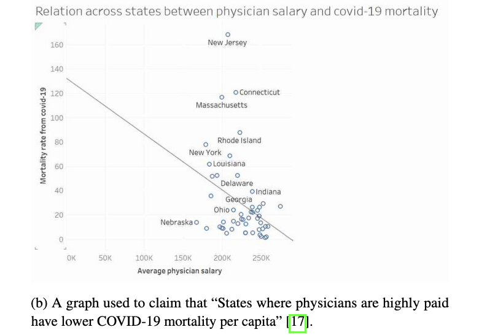

Reading an array of papers and essays that are outside of my current electrophysiology/connectivity/modeling bubble definitely takes away the time that I could spend feeling guilty about my code not working, but it’s still pretty fun. Here are some very good pieces of writing on three particular topics I’ve been pondering lately.

### Overpromising and overselling in science

[“Promisomics and the Short-Circuiting of Mind” by Gomez-Marin, 2021](https://www.eneuro.org/content/8/2/ENEURO.0521-20.2021/tab-article-info) (see also: [this article on the Human Brain Project](https://www.scientificamerican.com/article/why-the-human-brain-project-went-wrong-and-how-to-fix-it/)) criticizes the popularity of “-omics” approaches to mapping the brain. These approaches focus on collecting unbelievably huge amounts of data in hopes that more data leads to more understanding: projects like the Mouse Brain Project used supercomputers to model millions of neurons and their connections. But more often than not, these maps ignore a lot of complexities - diagramming a circuit does not take into account individual variability or dynamical contributions of memory and experience, and, even worse, are built under a faulty assumption - that knowing where every node is and how it connects to others will magically reveal how the entire machine operates. *“An infinite resolution map is not the territory”*. 

As someone who works with connectivity data, this is a challenging read, but I am inclined to agree with it, at least in part. Similar to the infamous [“Could a Neuroscientist Understand a Microprocessor?” paper](https://journals.plos.org/ploscompbiol/article?id=10.1371/journal.pcbi.1005268), the criticism of the approach is on the conceptual level - if we don’t know what process the circuit is implementing, it’s not helpful to know its wiring diagram. It doesn’t help that the steps to take to remedy the situation are not very clear. Still, it seems that some of the emphasis should be shifted from “more data, higher resolution” to developing high-level models that allow us to understand what data to gather and how to understand it best.

Talking about the unpleasant consequences of the scientific model as it is now, [“From Scientists to Salesmen”, an article by Jennifer Lee](https://magazine.scienceforthepeople.org/vol24-2-dont-be-evil/from-scientists-to-salesmen/) (see also: [David Graeber on scientific output](https://thebaffler.com/salvos/of-flying-cars-and-the-declining-rate-of-profit)) highlights some of the worst current trends: increasing emphasis on self-promotion and marketing of your scientific “brand”, the profitability (both in money and scientific “clout”) of quick and flashy advances, competition between labs and the scramble for publications impeding genuine progress, as exemplified by the meteoric rise and fall of the Human Brain Project. 

Originally proposed as an insanely ambitious large scale project that would understand the brain fully, HBP quickly devolved into not much conrete output, despite hundreds of papers written. Similar to the Human Genome Project, understanding the hardware did not bring much with it, so perhaps it’s time to stop and think about “whether we should” do this, and not “if we can”. Jennifer Lee also calls for increased collaboration within science, as well as allowing people to stay in science and simply work without feeling the need to claw their way to the top while pushing out paper after paper. Academia can be a dangerously precarious job, which doesn’t bode well for our quest of understanding “life, the universe and everything” - try doing that if you don’t know if you’ll have a job in 2 years.

### Scientific revolutions and paradigms

[“The Structure of Scientific Revolutions” by Thomas Kuhn](https://en.wikipedia.org/wiki/The_Structure_of_Scientific_Revolutions) has been gathering dust on my shelves for about 4 years, but hooray, the day has come for me to pick it up. According to Kuhn, science is not a slow incremental process, but rather a process of establishing and then disrupting a scientific paradigm via a revolution (e.g., Copernicus). Changing a paradigm involves discovering anomalies that can’t be accounted by current theories, but also needs the consensus of scientists and sometimes even precipitates rewriting scientific history. 

This book was sometimes criticized for reminding people that scientists aren’t paragons of objectivity and can occasionally be human with all the resulting irrationality, which is something I often have to argue with people about. It never feels good to have to knock science off its pedestal and the balance between eroding people’s trust in science and instilling healthy skepticism can be pretty hard.

 I want to hand this image out at conferences (Figure 2 from  Gomez-Marin and Ghazanfar, 2021)

In a scathing article directed primarily at other scientists, [Gomez-Marin and Ghazanfar, 2021](https://www.sciencedirect.com/science/article/pii/S0896627319307901) write that “bodies aren’t just brain-holding vats that passively react to the environment”, “behavior isn’t just a stimulus-response operation” and “mice are not tiny humans”, single-handedly devastating the entire cognitive neuroscience community. I don’t think this much needed change in how we approach cognition will come any time soon, but I’ve actually been seeing more complex studies and work on embodied cognition lately.

Other fields have also been getting their fair share of criticism from the inside. [Weiss and Shanteau, 2021](https://pubmed.ncbi.nlm.nih.gov/34508955/) discuss the current reigning paradigm in decision making research and how it led to weak research in the field. In particular, the authors criticize the common use of simplistic models that constrain potential situations and responses, echoing the “naturalistic behavior” plea. Some cognitive neuroscience experiments have always struck me as weird, as the connection between the experiment and its real life analogue can be quite murky, but the findings are usually reported as if they apply to the naturalistic behavior directly (I guess it wouldn’t be as flashy to say that this one brain region activates in this specific variation of a two-armed bandit task).

The famed replication crisis has caused an avalanche of criticism on how we approach statistics in neuroscience and psychology (although it can be argued that the pressure to publish is as much at fault here as shoddy stats). Most of these criticisms come in form of small incremental changes that we could implement. In contrast, an article by [Chen et al, 2021](https://www.biorxiv.org/content/10.1101/2021.05.09.443246v2.full.pdf) discusses a potential paradigm shift in neuroimaging analysis and reporting of results. Commonly used approaches for simplifying and “digesting” data into conclusions can be misguided and wasteful, and lead to all-or-nothing thinking which is already too prominent in science. It’s always interesting to examine the assumptions that lie behind a method of analysis, because, with time, these tend to fade into the background a bit. 

### Design and visualization

This is a much less heavy topic than “oof, science kind of sucks”, but is probably equally important. Awkward, cramped and hard to understand visualizations are the bread-and-butter of science, but it doesn’t have to be this way. The importance of good design also borders more serious issues, such as inaccessibility of scientific findings to laypeople and bad science journalism. 

 Color me convinced! (Figure from Corell, 2021)

[Corell, 2021](https://arxiv.org/abs/2109.12975) discusses “bullshit visualizations” that, intentionally or not, muddle, obscure or straight up change the message of the data. Some of the examples are hilarious, but others are mostly concerning (e.g. fitting a line to a circular scatterplot blob and claiming an effect) or just making up a graph to back up a point. These types of visualizations are less prominent in science, but it’s still a good reminder to not use more visualizations than you have to.

[Crameri et al, 2020](https://www.nature.com/articles/s41467-020-19160-7) talk about how colormaps can mislead the interpretation of data (TL;DR: don’t use the rainbow colormap, it’s bad!). I wish there was more concrete and easy to use advice out there on visualizations: I have been making a lot of plots for my data and working with color on personal projects and I’ve learned one thing - I don’t know anything about colors or how to combine them effectively or what goes well with what. If you know any good resources (as long as they don’t insist on telling me that red is a color that indicates passion), let me know.

